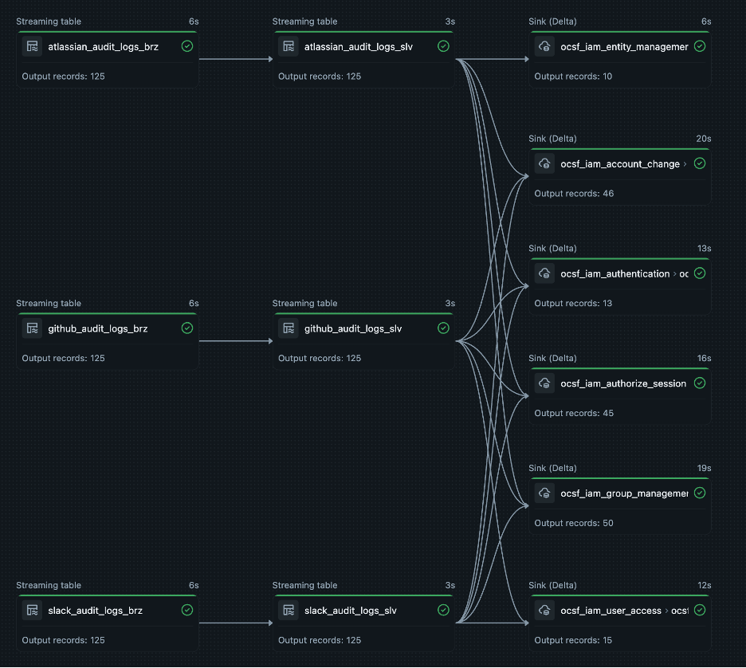

# E2E OCSF Cyber Lakehouse Blueprint

**Medallion Architecture** (Bronze → Silver → Gold) that transforms audit logs from GitHub, Slack, and Atlassian into **OCSF 1.7.0 IAM-normalized** security events.

## 🎯 What This Does

Unifies audit logs from multiple sources into **6 OCSF IAM tables** for cross-platform security analytics and SIEM integration.

**Problem**: Schema chaos, duplicate data, 100+ tables, pipeline jungles  
**Solution**: 6 unified tables, single source of truth, one query across all sources

## 🏗️ Pipeline Architecture



*Pipeline output using sample audit log files from `_raw_logs/` folder*

**15 Append Flows** → **6 Unified OCSF Tables** | All streaming tables ✅

## 📂 Repository Structure

```
e2e-ocsf-cyber-lakehouse-blueprint/
│
├── transformations/
│   ├── pipelines/                      # Bronze & Silver layers
│   │   ├── github/audit_logs/          # GitHub ingestion & parsing
│   │   ├── slack/audit_logs/           # Slack ingestion & parsing
│   │   └── atlassian/audit_logs/       # Atlassian ingestion & parsing
│   │
│   └── mappings/ocsf/iam/              # Gold layer (OCSF normalization)
│       ├── gold_github_audit_logs.py       # GitHub → OCSF transformations
│       ├── gold_slack_audit_logs.py        # Slack → OCSF transformations
│       ├── gold_atlassian_audit_logs.py    # Atlassian → OCSF transformations
│       └── gold_ocsf_iam_event_classes.py  # Creates 6 unified OCSF tables
│
├── utilities/
│   └── utils.py                        # Shared constants (catalog, databases, tables, etc.)
│
├── _resources/
│   ├── OCSF_ARCHITECTURE.md            # OCSF overview, categories, IAM classes
│   └── PIPELINE_OVERVIEW.md            # Pipeline patterns, ingestion examples
│
└── _raw_logs/                          # Sample audit log files
    ├── github-audit-logs.json
    ├── slack-audit-logs.json
    └── atlassian-audit-logs.json
```

## 🛡️ OCSF IAM Event Classes

6 unified tables mapping 15 source flows:

| OCSF Class | UID | Sources |
|------------|-----|---------|
| **account_change** | 3001 | GitHub, Slack, Atlassian |
| **authentication** | 3002 | GitHub, Slack, Atlassian |
| **authorize_session** | 3003 | GitHub, Slack, Atlassian |
| **entity_management** | 3004 | Atlassian only |
| **user_access_management** | 3005 | GitHub, Slack |
| **group_management** | 3006 | GitHub, Slack, Atlassian |

**OCSF Version**: 1.7.0 | **Category**: IAM (UID 3) | **Docs**: https://schema.ocsf.io/1.7.0/categories/iam

---

**Tech Stack Built with 💜**: OCSF v1.7.0 • Databricks 🚀 • Spark Declarative Pipelines • Spark Streaming • Auto Loader • Delta Lake • Unity Catalog
